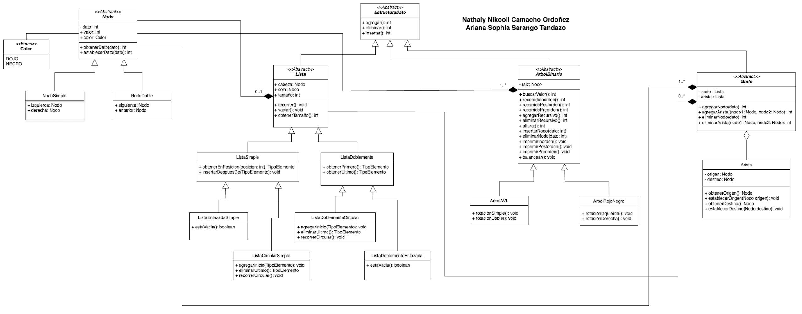

# EstructuraDatos

**Integrantes:**

* Nathaly Nikooll Camacho Ordoñez.
* Ariana Sophía Sarango Tandazo.

**Ciclo:**

* Segundo "A"

## ACD - ESTRUCTURA DE DATOS

Generar un diagrama UML y código en Java con las siguientes características:

* Arboles binarios (AVL y Rojo Negro).
* Grafo.
* Listas enlazadas.
* Listas doblemente enlazadas.
* Listas circular.
* Listas doblemente circulares.
* En el caso de los arboles genere recorridos en orden, postorden y preorden, en todas las demas presente de acuerdo al orden de inserción.
* En todas las estructuras se pueda agregar, insertar y eliminar.

## Diagrama UML

## Estructura del Proyecto

El proyecto está organizado de la siguiente manera:

### **Enumeraciones**

* **Color:** Define los colores ROJO y NEGRO.

### **Clases Abstractas**

* **Nodo:** Clase abstracta para los nodos, con atributos dato y color.
* **Lista:** Clase abstracta para las listas, con atributos cabeza, cola y tamaño.
* **EstructuraDato:** Clase abstracta para las estructuras de datos con métodos agregar, eliminar e insertar.
* **ArbolBinario:** Clase abstracta para los árboles binarios con varios métodos para operaciones de árbol.
* **Grafo:** Clase abstracta para los grafos, con listas de nodos y aristas.

### **Clases Concretas**

#### _Nodos_

* **NodoSimple:** Extiende Nodo y añade el atributo siguiente.
* **NodoDoble:** Extiende Nodo y añade los atributos siguiente y anterior.

#### _Listas_

* **ListaEnlazadaSimple:** Extiende Lista con implementación específica para listas enlazadas simples.
* **ListaDobleEnlazada:** Extiende Lista con implementación específica para listas doblemente enlazadas.
* **ListaCircularSimple:** Extiende ListaEnlazadaSimple para listas circulares simples.
* **ListaDobleCircular:** Extiende ListaDobleEnlazada para listas doblemente circulares.

#### _Árboles_

* **ArbolAVL:** Extiende ArbolBinario con implementación específica para árboles AVL.
* **ArbolRojoNegro:** Extiende ArbolBinario con implementación específica para árboles Rojo-Negro.

#### _Grafo_

* **Arista:** Define una arista con nodos.
